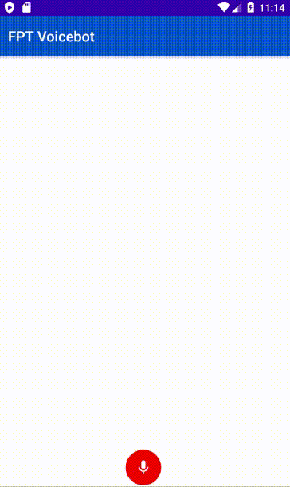

# FPT-AI Speech SDK
[](https://fpt.ai)  
Thư viện FPT-AI Speech SDK giúp chuyển đổi từ giọng nói sang kết quả intent và entity:
# Cài đặt
Tạo project android sử dụng SDK
Thêm config sau vào root local.properties (ví dụ ở file local.sample.properties)
```
VOICE_API_KEY=cKLT3WyMxeLOKrKECqqnmtDTvvaqOTLS
VOICE_API_ENPOINT=https://api.fpt.ai/hmi/asr/general
SOCKET_ENDPOINT=wss://livechat.fpt.ai/ws/
BOT_CODE=501652a17afaed439ea49abc6e166b2e
```
Thêm đoạn code sau vào file build.gradle của app, đặt sau versionName
```java
Properties properties = new Properties()
        if (rootProject.file("local.properties").exists()) {
            properties.load(rootProject.file("local.properties").newDataInputStream())
        }
        // Inject the Maps API key into the manifest
manifestPlaceholders = [ voiceAPIKey : properties.getProperty("VOICE_API_KEY", ""),
                        voiceAPIEnPoint : properties.getProperty("VOICE_API_ENPOINT", ""),
                        socketEndpoint: properties.getProperty("SOCKET_ENDPOINT", ""),
                        otCode: properties.getProperty("BOT_CODE", "")]
```
Thêm đoạn cấu hình sau vào file AndroidManifest.xml của app đặt sau thẻ activity
```xml
<meta-data
    android:name="ai.fpt.voicebot.API_KEY"
    android:value="${voiceAPIKey}" />
<meta-data
    android:name="ai.fpt.voicebot.API_ENDPOINT"
    android:value="${voiceAPIEnPoint}" />
<meta-data
    android:name="ai.fpt.voicebot.SOCKET_ENDPOINT"
    android:value="${socketEndpoint}" />
<meta-data
    android:name="ai.fpt.voicebot.BOT_CODE"
    android:value="${botCode}" />
```
Thêm cấu hình permission sau vào file AndroidManifest.xml của app đặt trước thẻ application
```xml
<uses-permission android:name="android.permission.INTERNET"/>
<uses-permission android:name="android.permission.RECORD_AUDIO"/>
<uses-permission android:name="android.permission.WRITE_EXTERNAL_STORAGE"/>
<uses-permission android:name="android.permission.STORAGE"/>
```
Thêm dependency vào tập tin build.gradle của app
```
dependencies {
	implementation fileTree(dir: 'libs', include: ['*.jar'])
    implementation 'com.github.ybq:Android-SpinKit:1.4.0'
    implementation project(path: ':sdk-voicebot')
	}
```
# Sử dụng
Khai báo callback sau khi recognize audio, tin nhắn trả về từ bot, tin nhắn command
```java
public class MainActivity extends AppCompatActivity implements RecognizeListener, MessageListener
```
Khởi tạo VoiceBotClient trong Activity giao tiếp với bot
```java
try {
    ApplicationInfo applicationInfo = getPackageManager().getApplicationInfo(getPackageName(), PackageManager.GET_META_DATA);
    voiceBotSettings = VoiceBotSettings.buildSettings(applicationInfo);
} catch (PackageManager.NameNotFoundException e) {
    e.printStackTrace();
}
voiceBotClient = VoiceBotClient.create(voiceBotSettings, this, this);
```
Kết nối tới socket để nhận tin nhắn trả lời từ bot
```java
voiceBotClient.connectSocket();
```
Sự kiện bắt đầu recording audio thực hiện kiểm tra permission và gọi hàm startRecording từ SDK
```java
if (checkPermissions()) {
    startRecording.setVisibility(View.INVISIBLE);
    stopRecording.setVisibility(View.VISIBLE);
    voiceBotClient.startRecording();
}
else {
    requestPermissions();
}
```
Sự kiện kết thúc recording và thực hiện recognize audio
```java
startbtn.setEnabled(true);
stopbtn.setEnabled(false);
File audio = speechClient.stopRecording();
speechClient.recognize(audio);
```
Sự kiện recognized được trả về 2 method sau
```java
@Override
public void onRecognizedSuccess(String utterance) {}

@Override
public void onRecognizedFailed() {}
```
Nếu thành công thực hiện gửi tin nhắn cho bot
```java
voiceBotClient.sendMessageToSocket(utterance);
```
Sự kiện tin nhắn trả về bao gồm tin nhắn người dùng gửi, tin nhắn bot trả về, sự kiện command được trả về trong 3 method sau:
```java
@Override
public void onUserMessage(String message) {}
@Override
public void onBotMessage(String message) {}
@Override
public void onCommand(String deepLink) {}
```
Sự kiện commad sẽ được trả về dạng deepLink:
```
voicebot://funds-transfer?type=internal&source=00001111222&destination=11110000222&amount=400000&narrative=chuyen tien an
```
ScreenShot  
[](https://fpt.ai)  
License
----

MIT

